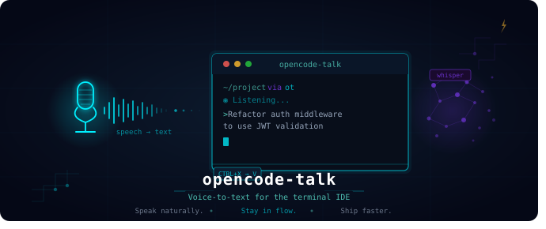

<div align="center">

# opencode-talk



**Voice-to-text for the terminal IDE.**

Toggle your microphone, speak naturally, and get Whisper-quality transcription injected straight into your opencode prompt. No context switching, no copy-paste, no browser tabs.

[](https://bun.sh)
[](https://www.npmjs.com/package/@theoparashkevov/opencode-talk)
[](./LICENSE)
[](./src/__tests__)
[](https://github.com/theoparashkevov/opencode-talk/actions)

</div>

---

## Why voice in a terminal?

You've felt it. You're 10 tabs deep in implementation logic, hands on the keyboard, and you need to ask the AI something nuanced. Switching to a browser voice widget breaks flow. Typing a long, precise paragraph slows you down.

**Speaking is thinking in real-time.** This plugin lets you stay inside opencode's TUI, hit a single key chord, talk for 10 seconds, and have the transcript sitting in your prompt ready to send.

> *"The best interface is the one you don't notice. Voice should just be there."*

---

## 30 seconds to voice

```bash
# 1. Install (development symlink)
git clone https://github.com/theoparashkevov/opencode-talk.git
bun install
echo '{"plugin":["/path/to/opencode-talk"]}' > ~/.config/opencode/tui.json

# 2. Set your key
export OPENAI_API_KEY="sk-..."

# 3. Start opencode and press ctrl+x, then v
opencode
```

That's it. No bundling step, no config files, no restart loops.

---

## How it works

```
  You                          opencode-talk                    OpenAI
   |                                |                             |
   |  <leader>v  (ctrl+x → v)       |                             |
   |------------------------------->|                             |
   |                                |  ffmpeg / sox / parecord    |
   |                                |  (auto-detected)            |
   |  [  Listening ···   ]          |                             |
   |<-------------------------------|                             |
   |                                |                             |
   |  "Refactor the auth middleware  |                             |
   |   to use JWT instead of        |                             |
   |   session cookies"             |                             |
   |                                |                             |
   |  <leader>v                     |                             |
   |------------------------------->|                             |
   |                                |  POST /audio/transcriptions |
   |                                |---------------------------->|
   |                                |                             |
   |                                |  "Refactor the auth..."     |
   |                                |<----------------------------|
   |                                |                             |
   |  [prompt updated]              |                             |
   |<-------------------------------|                             |
   |                                |                             |
```

---

## Features

| | |
|:---|:---|
| **Toggle recording** | Press once to start, press again to stop + transcribe. Dead simple. |
| **Live indicator** | Animated `Listening ···` toast while the mic is open so you know it's on. |
| **Whisper under the hood** | OpenAI `whisper-1` by default. Switch to `gpt-4o-transcribe` or `gpt-4o-mini-transcribe` in settings. |
| **Audio tool fallback** | Prefers `ffmpeg`, falls back to `sox`, then `parecord` on Linux. Works on macOS and most Linux distros out of the box. |
| **KV-backed settings** | `/voice-config` inside opencode to change API key, model, audio device, custom prompt, and notification toggles. Persists across restarts. |
| **Zero temp-file leaks** | Cleanup runs on success, error, cancellation, and plugin unload. |
| **Custom transcription prompt** | Guide Whisper with a prompt (e.g. "preserve variable names like `userSession`"). |
| **Notification toggles** | Turn off the recording indicator or the final "Transcription Done" toast if you prefer silence. |
| **Provider abstraction** | `TranscriptionProvider` interface is ready for Google Cloud Speech, Azure, AssemblyAI, or local Whisper. |

---

## Installation

### Option A: Symlink for development (recommended)

Opencode's TUI plugin loader reads from `~/.config/opencode/tui.json`:

```bash
git clone https://github.com/theoparashkevov/opencode-talk.git
bun install
cd opencode-talk

# Point tui.json at this repo
mkdir -p ~/.config/opencode
echo '{"plugin":["/path/to/opencode-talk"]}' > ~/.config/opencode/tui.json
```

The plugin auto-loads on the next `opencode` startup. No build step needed — Bun runs `.js` and `.ts` natively.

### Option B: npm (when published)

```json
{
  "$schema": "https://opencode.ai/tui.json",
  "plugin": ["opencode-talk"]
}
```

opencode installs it automatically on startup.

---

## Prerequisites

1. **Bun** — `curl -fsSL https://bun.sh/install | bash`
2. **An audio capture tool** — at least one of:
   - `ffmpeg` (recommended)
   - `sox`
   - `parecord` (Linux)
3. **OpenAI API key** — `export OPENAI_API_KEY="sk-..."`

### ffmpeg install

```bash
# macOS
brew install ffmpeg

# Debian / Ubuntu
sudo apt update && sudo apt install ffmpeg

# Arch
sudo pacman -S ffmpeg
```

---

## Usage

### Keybind

Press **`<leader>v`** — that's `ctrl+x` then `v` (same prefix pattern opencode-voice uses for TTS).

### Slash commands

| Command | Description |
|---------|-------------|
| `/voice` / `/mic` / `/talk` | Toggle recording |
| `/voice-config` / `/vconf` | Open settings dialog |

### Settings dialog (`/voice-config`)

Inside the dialog you can configure:

- **API Key** — Override `$OPENAI_API_KEY` per-plugin
- **Audio Device** — Specify a device name/index (leave empty for system default)
- **Model** — `whisper-1` (default), `gpt-4o-transcribe`, `gpt-4o-mini-transcribe`
- **Custom Prompt** — Instructions sent to Whisper alongside the audio
- **Show Recording Indicator** — Toggle the animated `Listening ···` toast
- **Show Transcription Toast** — Toggle the final "Transcription Done" success toast
- **Reset to Defaults** — Clear all stored preferences

All settings persist across opencode restarts via `api.kv`.

---

## Example session

```
[opencode TUI]

You: <leader>v
[Recording — Listening ···]

You: "Generate a React hook that debounces
       a search input with a 300ms delay
       and cancels pending requests"

You: <leader>v
[Transcribing...]

[prompt updated]: Generate a React hook that debounces
a search input with a 300ms delay and cancels pending requests

You: <Enter>
[AI responds with useDebounce hook]
```

---

## Architecture

```
src/
├── index.ts              # Plugin entrypoint (TuiPlugin API)
├── settings.ts           # KV-backed config (api.kv get/set)
├── config.ts             # Env var resolution + Zod validation
├── types.ts              # Shared interfaces (TranscriptionProvider, etc.)
├── utils.ts              # Temp files, logging, safe spawn
├── audio/
│   └── recorder.ts       # ffmpeg / sox / parecord wrapper
└── transcription/
    └── openai.ts         # Whisper provider with retry + cancellation
```

### Design decisions

- **No build artifact for dev** — `index.js` is plain ESM that imports `./src/*.ts`. Bun handles it natively.
- **Single-file TUI export** — matches opencode's `PluginModule = { id, tui }` contract.
- **Provider interface** — swapping Whisper for a local whisper.cpp server or Google STT is ~20 lines.
- **AbortSignal propagation** — cancellation aborts the in-flight HTTP request, not just the promise wrapper.
- **No server-side code** — purely a TUI plugin. No background agent, no persistent process.

---

## Extending

### Adding a new transcription provider

1. Implement `TranscriptionProvider` in `src/transcription/<name>.ts`:

```typescript
import { TranscriptionProvider } from "../types.js";

export class LocalWhisperProvider implements TranscriptionProvider {
  async transcribe(audioPath: string, signal?: AbortSignal): Promise<string> {
    // your implementation
    return text;
  }
}
```

2. Update `index.js` to instantiate it based on `config.provider`.
3. Add the provider name to `settings.ts` schema.

See `src/transcription/openai.ts` for the reference implementation.

---

## Development

```bash
# Install dependencies
bun install

# Run tests (37 cases, all green)
bun test

# Type check
bun run typecheck

# Bundle for distribution
bun run bundle
```

---

## Troubleshooting

| Problem | Fix |
|---------|-----|
| `No audio capture tool found` | Install `ffmpeg` (see Prerequisites). The plugin auto-detects available tools. |
| `Permission denied` when recording | `sudo usermod -aG audio $USER` then log out and back in (Linux). |
| `Invalid OpenAI API key` | Check that `OPENAI_API_KEY` is set and starts with `sk-`. You can also set it via `/voice-config`. |
| Transcription is empty | Ensure your microphone isn't muted and you speak for at least 1–2 seconds. Very short clips may return empty strings from Whisper. |
| `<leader>v` doesn't work | The leader key in opencode is `ctrl+x`. Press `ctrl+x`, release, then press `v`. |
| Plugin not listed in `/plugins` after `opencode plugin install` | The installer may write config without unpacking the package. Use **local path** instead (see Development Installation above) or check that the package exists in `~/.config/opencode/.opencode/node_modules/.opencode/node_modules/@theoparashkevov/opencode-talk/`.
| Plugin not listed in `/plugins` after `opencode plugin install` | The installer may write config without unpacking the package. Use **local path** instead (see Development Installation above) or check that the package exists in `~/.config/opencode/.opencode/node_modules/.opencode/node_modules/@theoparashkevov/opencode-talk/`.
| Plugin not listed in `/plugins` after `opencode plugin install` | The installer may write config without unpacking the package. Use **local path** instead (see Development Installation above) or check that the package exists in `~/.config/opencode/.opencode/node_modules/.opencode/node_modules/@theoparashkevov/opencode-talk/`.
| Plugin not listed in `/plugins` after `opencode plugin install` | The installer may write config without unpacking the package. Use **local path** instead (see Development Installation above) or check that the package exists in `~/.config/opencode/.opencode/node_modules/.opencode/node_modules/@theoparashkevov/opencode-talk/`.

---

## A note for the opencode core team

Voice input feels like a first-class feature, not a plugin — and there's a reason the TTS counterpart (`opencode-voice`) already ships as an official plugin. Speech-to-text has the same ergonomics: a single key chord, a brief indicator, and the result lands in the prompt.

**What we'd love to see upstream:**

- A built-in `<leader>v` binding or official plugin slot for STT (like TTS has `<leader>s`)
- A standard `audio` permission model so plugins don't need to wrap `ffmpeg` directly
- Access to the platform's native mic APIs instead of shelling out to CLI tools

This plugin proves the workflow works end-to-end. If there's appetite for bringing it into core, we're happy to help port, refactor, or donate the code.

---

## License

MIT

---

<div align="center">

Built with [Bun](https://bun.sh) and [opencode](https://opencode.ai).

</div>
